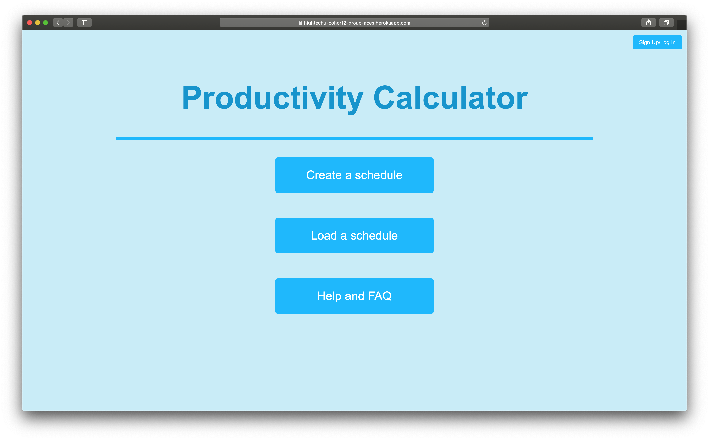
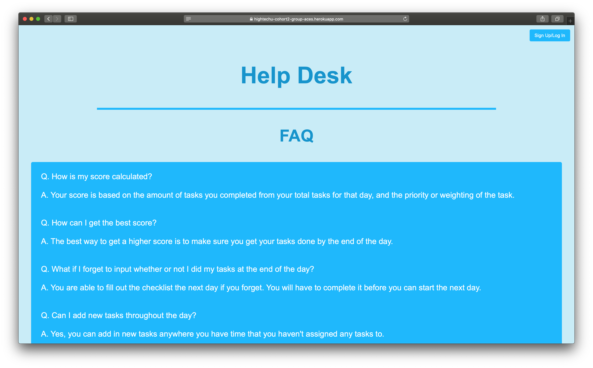
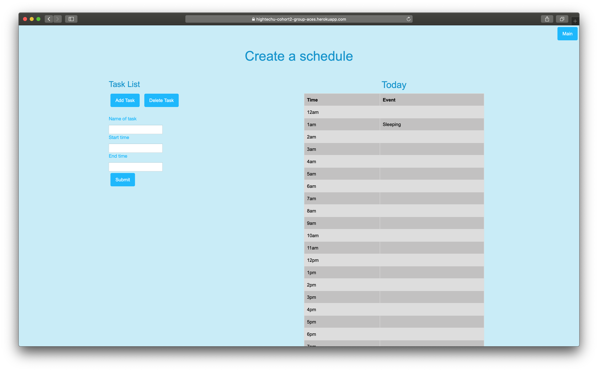
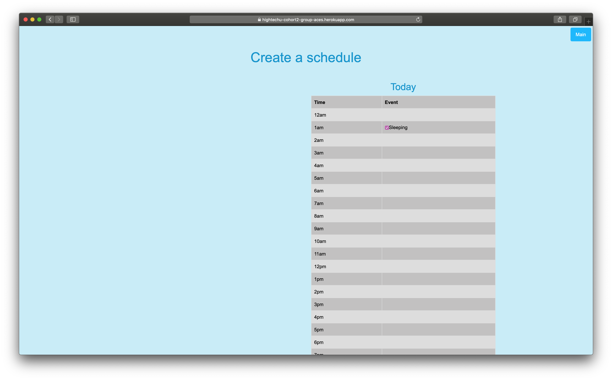

# Productivity Calculator

**2019 HighTechU Academy - Cohort 2**

## Website

https://productivitycalculator.herokuapp.com

## Mini Pitch

It helps the user keep track of tasks they have to do and assign a score at the EOD based on how they fared in doing their tasks.

## Problem Statment

People waste too much time during the day.

## User Stories

4 Main User Stories:

* A a User I should be able to signup or login.
* As a User, I should be able to navigate from the Main page.
* As a User, I should be able to create a schedule.
* As a User, I should be able to see the FAQ/About Us page.

## Website Pages

* Login Page -> index.html
* Navigation Page -> main.html
  * Create Schedule Page -> schedule.html
  * Help Page -> help.html
  * Load Schedule Page -> load.html
  * Summary Page -> summary.html

## Promo

## Made with:

* HTML
* CSS
* JS
* Loopback

## Made by:

* Adel
* Jorge
* Kyunje
* Lachlann
